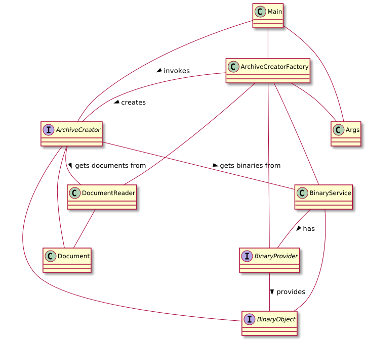
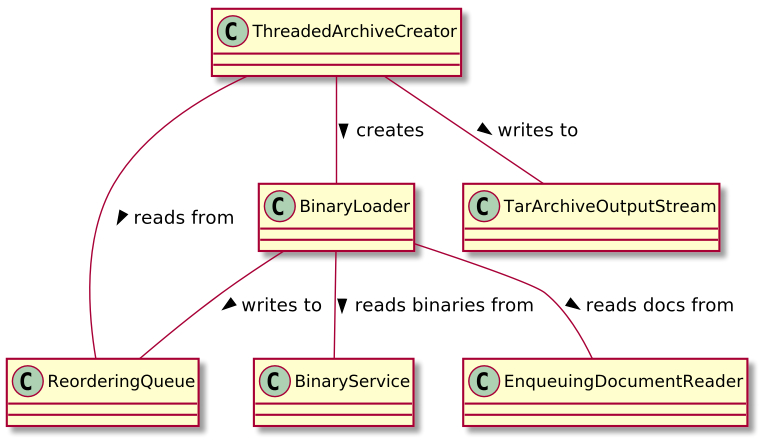

# archive-builder

This project proposes a design for generating a Linux TAR archive from two streams: One stream provides *documents*, and the second stream provides document *attachments*, also referred to throughout the project variously as *binaries* and *binary objects*.

The underlying assumption for this design is that the document stream exists in one store, and the document attachments are housed in a separate store.

For example, the documents could be in ElasticSearch, and obtained from ElasticSearch using the [Search Scroll API](https://www.elastic.co/guide/en/elasticsearch/client/java-rest/current/java-rest-high-search-scroll.html). In this scenario, one would obtain document metadata from ElasticSearch such as document title, date modified, etc. Included in that metadata might be a key that represents a document attachment which is an object in an S3 bucket.

The goal is to generate a TAR archive in which each TAR entry gets the document name from ElasticSearch, and the TAR entry content consists of the binary object from S3.

This project experimented with multi-threaded archive generation using small (1K) objects obtained from an S3 bucket using three AWS  SDK classes: The v1 `AmazonS3` and `TransferManager` classes, and the v2 `S3AsyncClient` class (configured with the Netty async I/O HTTP client.)

According to my cable provider, my max download throughput should be about 57 megabytes/second. And in fact when I generate an archive with S3 binaries sized 10K+ I achieved that throughput. But with objects in the 1K range in S3, the best throughput I achieved was using the new Netty async I/O AWS v2 SDK classes: `SdkAsyncHttpClient` and `S3AsyncClient`.

In the project, the v2 SDK classes are encapsulated in the `S3AsyncBinaryProvider` class. Using the Netty async classes I was able to achieve 1.347 megabytes/sec of download throughput. This is only 2% of the throughput that is achievable when downloading large objects from S3 but is significantly better than the performance using the v1 SDK classes.

Here are stats from an archive generation test from S3 using the v2 classes:

```
$ java -jar target/archive-builder.jar --scenario=multi --binary-provider=s3asyncclient\
  --document-count=50000 --threads=50 --cache-size=50000 --bucket=<redacted>\
  --region=<redacted> --keys=@./hack/l1-keylist --max-concurrency=500\
  --max-pend-acquires=100000 --archive=/tmp/foo.tar.gz
21:35:11.200 INFO org.ericace.Main 1 - Starting
21:35:48.685 INFO org.ericace.Metrics 1 - 
                                    Start: 2021-12-11 21:35:11.438
                                   Finish: 2021-12-11 21:35:48.670
                Elapsed (HH:MM:SS:millis): 00:00:37.231
                     Binary bytes written: 50,000,000
                  Binary bytes downloaded: 50,000,000.000000
              Binary bytes downloaded/sec: 1,347,527.375000
Binary download elapsed (HH:MM:SS:millis): 00:00:37.105

$ ls -lrt /tmp/foo*
-rw-rw-r-- 1 eace eace 797357 Dec 11 22:03 /tmp/foo.tar.gz
```

According to the stats above, 50 megabytes were downloaded from S3 and written to the TAR. This makes sense because the TAR has 50K entries, each of 1K. Since it a gzipped TAR, the 50 megs consumed only about 800K on the filesystem. You can see that the operation achieved 1.347 mbytes/sec of download throughput.

The S3 bucket content was generated using the `hack/genfiles` script:

```
hack/genfiles 1 <bucket-redacted> | tee hack/l1-keylist
```

The `genfiles` command above generates ten thousand 1K files in the specified bucket each with a single-depth prefix matching the filename, like `0000/0000`, `0001/0001` ... `9999/9999`. Tee'ing the script allows the output to be used as input to the `--keys` option of the archive-builder JAR.

## Building

```
mvn clean install -DskipTests
```

The command above creates an all-in-one JAR in the `target` directory:

```
$ ls -l target/archive-builder.jar
-rw-rw-r-- 1 eace eace 20025697 Dec 11 21:31 target/archive-builder.jar
```

...and in your local Maven repo:

```
$ ls -l ~/.m2/repository/org/ericace/archive-builder/1.0-SNAPSHOT/*.jar 
-rw-rw-r-- 1 eace eace 20025697 Dec 11 21:31 /home/eace/.m2/repository/org/ericace/archive-builder/1.0-SNAPSHOT/archive-builder-1.0-SNAPSHOT.jar
```

## Running

```
$ java -jar target/archive-builder.jar --help
```

...should get you started.

## Design

The following PlantUML-generated diagram shows the high-level design:



Design narrative:

1. The `Main` class delegates command line parsing to the `Args` class. Thus, the `Args` class has the complete configuration for each invocation of the utility.
2. After arg parsing, the `Main` class uses the `ArchiveCreatorFactory` class to generate an `ArchiveCreator` instance based on the configuration provided on the command line. The factory also creates a `BinaryService` and a `DocumentReader`.
3. The `ArchiveCreator` manufactured by the factory uses the `DocumentReader` to get `Document` instances to write to an archive, and uses the `BinaryService` to get binary document attachments.
4. The `BinaryService` in turn uses a `BinaryProvider` to actually get objects from S3. Each binary attachment from S3 is modeled as a `BinaryObject`.
5. The `ArchiveCreator` generates a gzipped TAR archive (the archive is not shown in the diagram.)

## Threaded Archive Generation

In order to parallelize archive generation by downloading attachments in parallel, the `ThreadedArchiveCreator` class implements the following design:



Design narrative:

1. The `ThreadedArchiveCreator` creates a pool of `BinaryLoader` threads.
2.  Each `BinaryLoader` instance in the thread pool uses a shared `EnqueuingDocumentReader` to get `Document` instances, and a shared `BinaryService` to get a binary attachment for each `Document`.
3. Each `BinaryLoader` thread pool instance writes to the `ReorderingQueue` **out of order** based on the order in which binary attachments are downloaded from S3.
4. The `ThreadedArchiveCreator` reads from the `ReorderingQueue` which provides documents **in the same order** that they were enqueued by the `EnqueuingDocumentReader`.
5. Each item pulled from the `ReorderingQueue` contains both a `Document` and a `BinaryObject` instance. These are used to generate entries in the `TarArchiveOutputStream`, thus creating the TAR archive.